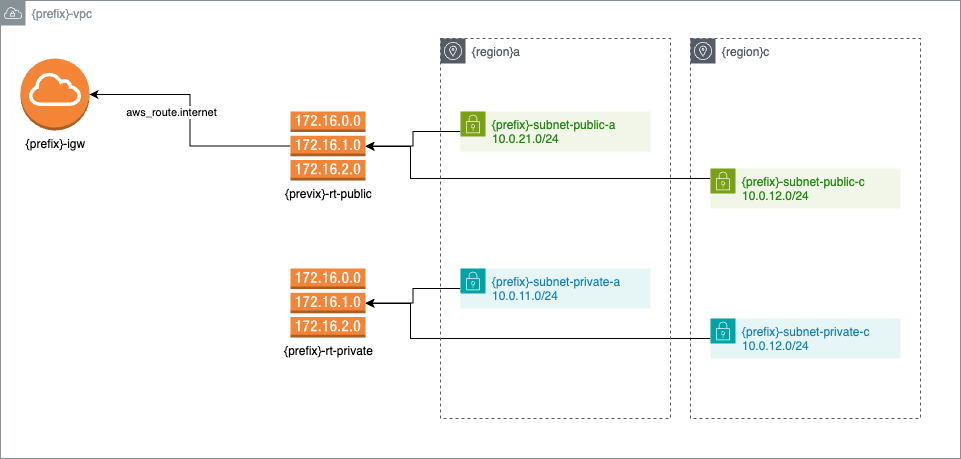
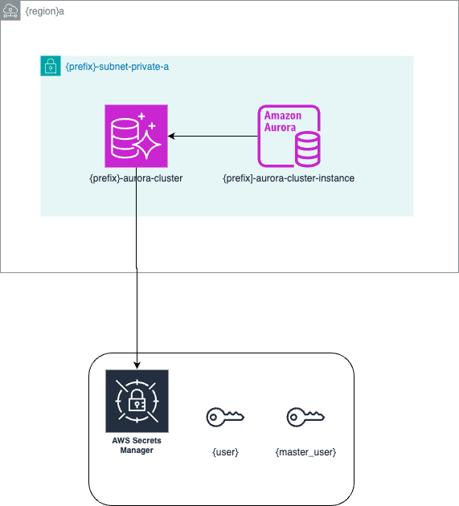
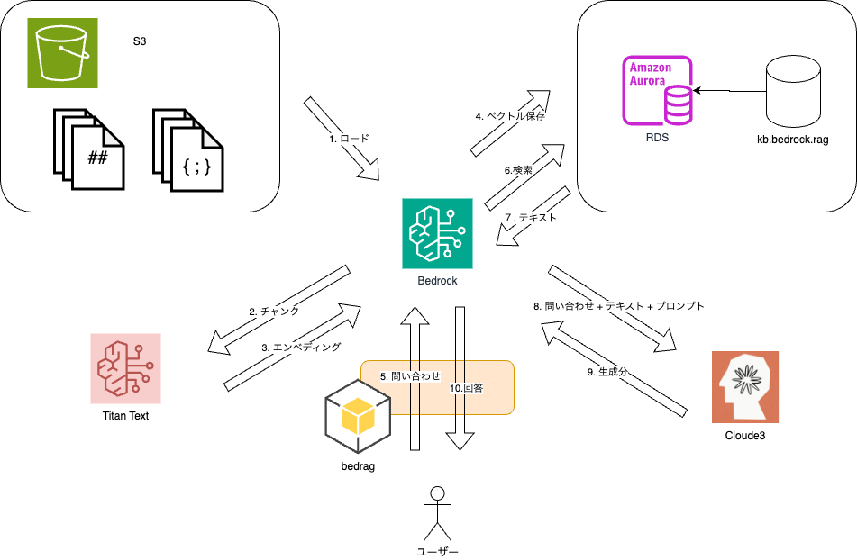

# AWS 基盤構築(RAG)

バックエンドリソースができたので、実際のリソースを作成します。
ここでは、Web API で問い合わせする前にコマンドで RAG の確認ができるまでのリソースをつくります。

## 基盤モデル(LLM)のリクエスト

本サンプルでは以下の LLM を使っています:

- [Amazon Titan Embeddings G1 - Text](https://docs.aws.amazon.com/ja_jp/bedrock/latest/userguide/titan-embedding-models.html)
- [Anthropic Claude 3 Sonnet](https://docs.anthropic.com/ja/docs/about-claude/models)

これらの LLM を Bedrock から使えるようにするために、[基盤モデルの利用をリクエスト](https://docs.aws.amazon.com/ja_jp/bedrock/latest/userguide/model-access.html)しておく必要があります。

## バックエンドの設定

前のセクションで作成したリソースをバックエンドのストアとステート管理で使うように `terraform` ステートメントに指定します。

rag.tf:

```tf
terraform {
  backend "s3" {
    # backend は variable評価前に実行されるので TF_VAR_ 環境変数を参照することになる
    region         = var.admin_region
    bucket         = "${var.service}-admin-state"
    key            = "terraform/${var.env}/terraform.tfstate"
    dynamodb_table = "${var.service}-admin-statedb-${var.env}"
  }
}
```

`terraform` ステートメントの実行時には、自身で定義した変数は使えないので、パラメトリックに定義するには環境変数を使います。
対応する変数に `TF_VAR_` でプレフィックスした環境変数で指定可能です。
`variables.tf` には `default` が定義されているので環境変数がなければ、それに従ってバックエンドのリソースが指定されます。

## OpenTofu の実行結果出力

rag/outputs.tf に作成したリソース情報を出力するように定義しています。

次のコマンドを実行すると、JSON に出力されます。:

```bash
docker compose run --rm tool tofu -chdir=tofu/rag output -json > .secrets/rag.json
```

aws-cli, boto3 を使ったスクリプトやプログラムにこの JSON を渡すことで、その都度リソースの名前や ARN を調べることなくコマンド実行可能になります。
よって、OpenTofu で apply した後でファイルを最新にしておくようにします。

## VPC

本プロジェクトでは RAG のバックエンドデータべースとして [Aurora RDS Serverless](https://aws.amazon.com/jp/rds/aurora/serverless/) を使います。
ネットワークの設定などが必要なので、まず VPC を作ります。

```bash
docker compose run --rm tool tofu -chdir=tofu/rag init
docker compose run --rm tool tofu -chdir=tofu/rag plan -out rag.plan  -target=module.vpc
docker compose run --rm tool tofu -chdir=tofu/rag apply rag.plan
```

VPC の概要図:



## Aurora RDS

次に [Aurora RDS PostgreSQL](https://docs.aws.amazon.com/ja_jp/AmazonRDS/latest/AuroraUserGuide/AuroraPostgreSQL.VectorDB.html) を作成し、VPC のネットワークで動作するように構成します。

```bash
docker compose run --rm tool tofu -chdir=tofu/rag plan -out rag.plan  -target=module.aurora
docker compose run --rm tool tofu -chdir=tofu/rag apply rag.plan
```

Aurora の概要図:



### ユーザー、スキーマ、テーブルなどの作成 (bin/aurora.py)

bin/aurora.py には `click` を使った Python スクリプトを定義してあります。
Aurora に対して boto3 を通じて psql と同様なステートメントを実行できるようにしてあります。
aurora.py スクリプトは OpenTofu が出力した AWS リソース情報の JSON ファイルを読み取って処理できるようにしてあります。

いくつかの共通ルーチンは `bedrag` パッケージに実装していますので、これを `import` して使います。

#### pgvector を有効にする

実行する前に「 OpenTofu の実行結果出力 」を行い、.secrets/rag.json を最新の状態にしておきます。

```bash
docker compose run --rm tool bin/aurora.py -to .secrets/rag.json setup-vector
```

#### アクセスユーザーの登録

```bash
docker compose run --rm tool bin/aurora.py -to .secrets/rag.json create-role
```

このユーザー情報は `DATABASE_USER` 環境変数を元に作成されます。
なお、この情報は Aurora RDS リソース作成の際、AWS シークレットマネージャにも登録されています。

#### スキーマ作成

```bash
docker compose run --rm tool bin/aurora.py -to .secrets/rag.json create-schema
```

#### RAG テーブルの登録

`bedrag` パッケージに SqlAlchemy を使って定義したモデル(Knowledge クラス)からテーブル生成を行います。

```bash
docker compose run --rm tool bin/aurora.py -to .secrets/rag.json create-table
```

また、作成したベクトルフィールドに対して検索効率を高めるためにインデックスを作成します:

```bash
docker compose run --rm tool bin/aurora.py -to .secrets/rag.json create-vector-index
```

#### RAG テーブル,スキーマに対してアクセスユーザーに許可を与える

```bash
docker compose run --rm tool bin/aurora.py -to .secrets/rag.json grant-schema
docker compose run --rm tool bin/aurora.py -to .secrets/rag.json grant-table
```

## Bedrock Knowledge base

Bedrock Knowledge base が利用するバックエンドデータベースが作成されたので、Knowledge base 本体を作成します。

```bash
docker compose run --rm tool tofu -chdir=tofu/rag plan -out rag.plan  -target=module.bedrock
docker compose run --rm tool tofu -chdir=tofu/rag apply rag.plan
```

ベクトル化と生成の概要図:


