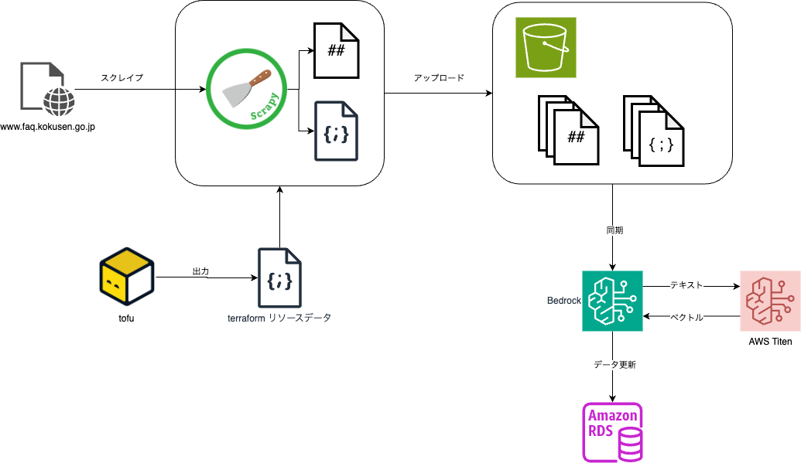

# データソース(消費者トラブル FAQ)

Bedrock Knowledge Base が作成されたので、データを登録する例を紹介します。
本サンプルでは 「国民生活センター」の 「消費者トラブル FAQ」 (https://www.faq.kokusen.go.jp/)をヘルプデスクデータとして動作させてみます。

## scrapy で国民生活センターの 消費者トラブル FAQ を取り込む

[Scrapy](https://scrapy.org/) をつかった Web スクレイピングプロジェクトを `scraper` に定義してあります。

概要図:



### Markdown

このサンプルでは `NcacFaqSpider` スパイダーに定義した内容で HTML を取得し、抜き出したデータを Markdown に変換します。
変換した Markdown テキストは `RagSourceItem` アイテムで保持されます。
最終的に、`RagSoourcePipeline` によって、 Bedrock のリソースの作成時に用意した S3 バケットに `.md` ファイルとして送信します。

バケット上のファイル名(バケットキー)は以下のようなルールにしてあります:

    国民生活センター/消費者トラブルFAQ.{id}.md

`id` は　 URL に含まれる FAQ の番号と思われる数字を採用してあります。

### メタデータ

`.md` ファイルと同時に `*.json` メタデータを作成して送信してあります。
このメタデータをつかって[メタデータフィルタリング](https://aws.amazon.com/jp/blogs/news/knowledge-bases-for-amazon-bedrock-now-supports-metadata-filtering-to-improve-retrieval-accuracy/)を可能しています。

以下のような JSON をメタデータとして送信しています:

```json
{
  "doc_class": "国民生活センター",
  "document": "消費者トラブルFAQ"
}
```

本サンプルでのメタデータフィルタリングについて詳しく解説していませんが、`bedrag` パッケージではメタデータ検索できるように実装してあります。

データソースを複数用意して知識対象を切り替えた結果生成を行う際にメタデータ検索を使うことができます。

### データの取り込み

次のコマンドにより、Web スクレイピングした結果を S3 にアップロードすることができます。

```bash
docker compose run --rm tool scrapy crawl ncacfaq -a aws=.secrets/rag.json
```

簡単な確認であれば、すべての FAQ を取り込む必要はないので適当な量の FAQ が取り込まれたら強制終了するなりしてください。

## データソースをナレッジベースに同期する

次のコマンドで Bedrock がデータソースの Markdown ファイルを Amazon Titan をつかってエンベッディングして、結果として得られたベクトルデータを RAG テーブルに格納する処理を行うことができます。

```bash
docker compose run --rm tool bin/kb.py -to .secrets/rag.json sync
```

この際、対応するメータデータ JSON も RAG テーブルの対応するフィールドに更新されます。

処理自体は同期処理ですので、UPSERT されます。また、S3 から削除するとテーブルからも削除されます。
同期情報は RAG テーブルの `bedrock_meta` に保存されています。

## LangSmith にプロンプトを実装する

本サンプルでは生成 AI に支持するプロンプトを [LangSmith](https://docs.smith.langchain.com/) で管理しています。

LangSmith で登録したプロンプトは引数で与えることができるようにしてあります。

`結果生成の確認` ではコマンドスクリプト実行で結果生成を確認していますが、この際、コマンドラインオプションで プロンプトを指定するようにしています。

## 結果生成の確認

次のコマンドで結果生成を確認することができます:

```bash
docker compose run --rm tool bin/rag.py -to .secrets/rag.json query "チケット転売で購入したのだがチケットが届きません" -s hdknr/faq
```

質問文は scrapy でデータソースに取り込んだ FAQ のどれかに近い内容を指定します。

また、 `-s` オプションで LangSmith に定義したプロンプトを指定しています。

例えば次ような結果が生成されます:

```
この事例では、チケット転売サイトで購入したチケットが届かず、転売業者とも連絡が取れない状況のようです。

FAQによると、このような場合は詐欺の疑いがあり、チケットの受け取りや返金を求めるのは困難とのことです。

対処方法としては、以下のようなアドバイスがあります。

1. 相手とのやり取りの記録(メール、チャットログなど)と支払い証拠を残しておく。

2. 警察の相談専用電話「#9110」に連絡し、詐欺被害の届け出をする。

3. 購入した際の決済方法によっては、クレジットカード会社などに連絡し、被害についての相談をする。

転売サイトを利用する際は、業者の信頼性を確認するなど、十分な注意が必要です。トラブルに巻き込まれた場合は、早めに専門機関に相談することが重要です。
```
