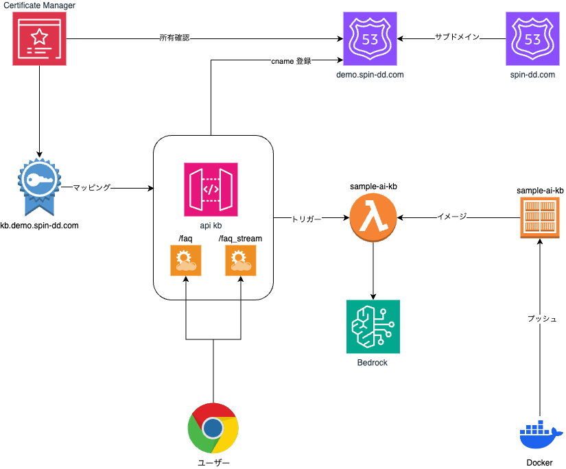

# API 実装と基盤

前のセクションで、 bin/rag.py スクリプトコマンドで RAG の結果が返答されることを確認しました。
この主たる処理は `bedrag` パッケージに実装されています。　(`get_answer` 関数)

ここでは `get_answer` 並びにそのストリーミング処理である `get_answer_stream` を Web API から呼ぶようにします。

概要図:



## `api` docker プロジェクト

`api` ディレクトリには API サーバーとして　 FastAPI を使って `bedrag` を呼び出すような Docker プロジェクトが定義されています。
本サンプルではこれにより作成した Docker イメージをつかって AWS Lambda 関数を構築し、この　 AWS Lambda 関数を AWS Api Gateway からトリガーで呼び出す、というサーバーレス環境を構築しています。

作成した Docker イメージを管理する ECR レポジトリを最初に作成します。

### LWA(AWS Lmabda Web Adapter)

[LWA](https://github.com/awslabs/aws-lambda-web-adapter?tab=readme-ov-file#aws-lambda-web-adapter)を使うことで Lambda 関数用に作られた Docker イメージを [AWS Fargate](https://aws.amazon.com/jp/fargate/) などでも通常の Web アプリケーションとして動作させることが可能になります。

LWA には以下の機能があります:

- AWS Lambda 上で Web アプリケーションを実行
- Amazon API Gateway の Rest API と Http API のエンドポイント、Lambda Function の URL、Application Load Balancer をサポート
- Lambda のマネージドランタイム、カスタムランタイム、Docker OCI イメージをサポート
- 任意の Web フレームワークや言語に対応
- バイナリ応答の自動エンコード
- グレースフル・シャットダウンが可能
- レスポンスのペイロード圧縮をサポート
- レスポンスのストリーミングをサポート
- 非 http イベントトリガーをサポート

本サンプルではストリーミング API も実装したいので LWA を使って Lambda 関数に Web アプリケーションを組み込んでいます。

以下の Docker ファイルの様にして組み込みます:

1. public.ecr.aws のイメージから LWA を COPY して追加
2. アプリケーションで接続する PORT を ENV で指定

```docker
FROM public.ecr.aws/lambda/python:3.12
COPY --from=public.ecr.aws/awsguru/aws-lambda-adapter:0.8.3 /lambda-adapter /opt/extensions/lambda-adapter
ENV PORT=8000
#
# ...
#
ENTRYPOINT ["uvicorn"]
CMD [ "main:app", "--host", "0.0.0.0", "--port", "8000"]

```

### ECR の作成

```bash
docker compose run --rm tool tofu -chdir=tofu/rag plan -out rag.plan  -target=module.ecr
docker compose run --rm tool tofu -chdir=tofu/rag apply rag.plan
```

ここでは、 `kb` と `tools` という２つの ECR レポジトリを登録しています。
API 自体は`kb` で管理します。

`tools` は後に説明する別の AWS Lamba 関数の Docker イメージ管理で使います。

## ビルドとプッシュ

`api/bin` ディレクトリの下に bash スクリプトがあるので、これにより Docker イメージをビルドして `kb` レポジトリにプッシュします:

```bash
./api/bin/login.sh .secrets/rag.json
./api/bin/build.sh .secrets/rag.json
./api/bin/push.sh .secrets/rag.json
```

## Route53

本サンプルでは サーバーレス API を https で呼び出すために [AWS Certificate Manager](https://aws.amazon.com/jp/certificate-manager/) を使って証明書を登録しています。このため、証明書で使うサーバー名(CNAME)を管理する Route53 サーバーが必要です。

本サンプルでは `spin-dd.com` を管理するドメインサーバーに対してサブドメインのゾーンである、`demo.spin-dd.com` を管理する Route53 サービスを定義しました。
テスト利用ではこの方式でよいとおもわれます。が、実際のサーバー名をどうするかによってこのやり方は異なってくると思います。

ただし、この方式であれば CNAME の登録から CNAME の所有権確認、証明書の発行まで OpenTofu で自動的に行うことができます。

## Lambda と API Gateway の構築

以下のコマンドで作成します。

```bash
docker compose run --rm tool tofu -chdir=tofu/rag plan -out rag.plan  -target=module.apigw
docker compose run --rm tool tofu -chdir=tofu/rag apply rag.plan
```

### Lambda の環境変数

Lambda 関数が動作する際の環境変数を設定します。基本的に手動で設定するようにしてありますが、 `BEDROCK_KB_ID` と `BEDROCK_LLM_MODEL_ID`は OpneTofu の実行時に自動的に設定します。

| 環境変数             | 内容                                                                                                     |
| -------------------- | -------------------------------------------------------------------------------------------------------- |
| BEDROCK_KB_ID        | Bedrock Knowlege base ID (OpenTofu が自動的に設定します)                                                 |
| BEDROCK_LLM_MODEL_ID | 生成 API でモデル ID( Claude 3 Sonnet の場合は `anthropic.claude-3-sonnet-20240229-v1:0"`)               |
| LANGCHAIN_TRACING_V2 | [LangChain Tracing](https://docs.smith.langchain.com/old/tracing/quick_start) (`true` など)              |
| LANGCHAIN_API_KEY    | [LangSmith](https://www.langchain.com/langsmith)のアクセスキー                                           |
| LANGCHAIN_ENDPOINT   | [LangSmith](https://docs.smith.langchain.com/) のエンドポイント (`https://api.smith.langchain.com` など) |
| LANGCHAIN_PROJECT    | LangSmith に設定したプロジェクト名                                                                       |
| PROMPOT_SMITH_NAME   | LangSmith に定義した名称                                                                                 |

## 動作確認

本サンプルの API は公開サービスとして認証の仕組みをよういしてありません。ので、`curl`コマンドで簡単に確認することができます。

`bin/rag.py` コマンドスクリプトには　`api ` というサブコマンドをよういしてありますので、これを実行すると確認することができます。

```bash
docker compose run --rm tool bin/rag.py -to .secrets/rag.json api "チケット転売で購入したのだがチケットが届きません"
```

```json
{
  "question": "チケット転売で購入したのだがチケットが届きません",
  "answer": "この事例では、チケット転売サイトで購入したチケットが届かず、転売業者とも連絡が取れない状況のようです。\n\nFAQの回答を参考にすると、このような場合は詐欺の疑いがあり、チケットの受け取りや返金を求めるのは困難とされています。\n\nそのため、対処方法としては以下のようなことが考えられます。\n\n1.
  売業者との連絡を改めて試みる\n2. 支払い記録などの証拠を残しておく  \n3. 警察に相談し、詐欺被害として届け出る\n\n特に3点目は、FAQでも「警察の相談窓口」を紹介しており、インターネット上の取引でトラブルに遭った場合の一般的な対処方法と言えます。\n\n被害の拡大を防ぐためにも、早期の警察への相談が賢明でしょう
  "
}
```

### ステトリーミング応答

`-s` オプションを指定すると、ストリーミング処理で返すエンドポイント(`/faq_stream`) を呼びだします。 ストリーミング処理では `text/event-stream` 形式でテキストを返すようにしています。

```bash
docker compose run --rm tool bin/rag.py -to .secrets/rag.json api "チケット転売で購入したのだがチケットが届きません" -s
```

```
2024-08-13 14:59:33.403601: FAQから、チケット転売で購入したがチケットが届かない場合の対処方法が見つかりました。
2024-08-13 14:59:33.404252: 相手と連絡が取れない場合は、チケットの受け取りや返金を求めるのが困難です。
2024-08-13 14:59:33.404294: 相手とのやり取りの記録や支払い証拠を警察に提示し、相談することが推奨されています。
2024-08-13 14:59:33.404320: 具体的には、
2024-08-13 14:59:33.404349: 1. 相手とのやり取り記録(メッセージのスクリーンショットなど)
2024-08-13 14:59:33.404371: 2. 支払った証拠(振込明細など)
2024-08-13 14:59:33.405445: を用意します。
2024-08-13 14:59:33.405479: 2. 警察の相談専用電話「#9110」に電話をして、最寄りの警察署を案内してもらいます。
2024-08-13 14:59:33.405489: 3. 警察署に出向き、準備した記録や証拠を提示して相談します。
2024-08-13 14:59:33.405496: 詐欺の疑いがある場合は、警察に被害届を提出することになるでしょう。
2024-08-13 14:59:33.405508: インターネット上の個人間取引にはリスクがあり、トラブルに巻き込まれる可能性がありますので、十分注意が必要です。
```
